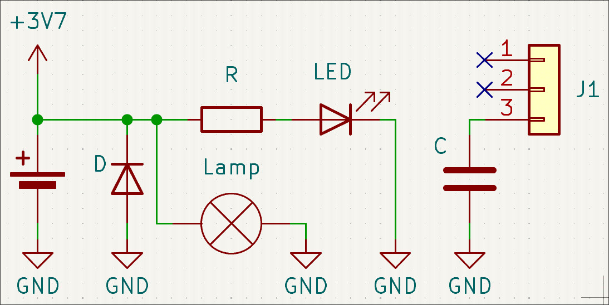
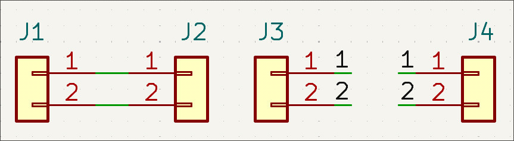

# Schéma électriques, logiciels d'ECAD et breadboard

Atelier d'introduction à la lecture de schémas, à la breadboard et à KiCad

## Objectifs de l'atelier

- Lire et comprendre un schéma électrique simple (symboles de base)
- Faire le lien entre un montage breadboard/proofboard/fils et un schéma électrique (dans les deux sens)
- Savoir réaliser un schéma électrique avec KiCad
- Comprendre le fonctionnement d'une breadboard, ses limites et son rôle (prototype ≠ produit fini)
- Comprendre ce qui peut "griller" les circuits électroniques et les réflexes qui l'évitent

## Matériel requis

- PCs avec KiCad
- Breadboard de qualité (half-size ~400 points suffit)
- Fils de liaison mâle–mâle
- Boutons-poussoirs
- Résistances triées (220 Ω, 330 Ω pour les LEDs ; 1 kΩ, 10 kΩ pour les boutons)
- LEDs
- Alimentations

## Informations

### 1. Symboles

Quelques symboles utiles.

:::warning

**Un schéma n'est PAS un plan de câblage.** Les fils se plient et se croisent librement sur le papier — c'est une représentation *logique*, pas une photo du montage.

:::

### 2. Méthodes de connexion : fil direct vs net labels

Connexion directe vs connexion avec des net labels.

- **Connexion directe** : on trace un fil entre deux points. Simple, mais illisible dès que le schéma grossit.
- **Net label** : on donne un **nom** à un fil (ex. `GND`, `5V`, `SIG`). **Tout ce qui porte le même nom est connecté**, même si on ne trace aucune ligne entre les deux.

**Net sur le schéma ≠ fil dans la vraie vie.** Un schéma montre la *connectivité*, pas la géométrie :

- sur le schéma, un net label connecte tout ce qui porte le même nom ;
- sur la breadboard, cette connectivité est réalisée par **n'importe quel chemin physique** — un long fil, les rails latéraux… peu importe, du moment que c'est *électriquement* le même nœud.

C'est aussi pour ça qu'on utilise des **symboles d'alimentation (VCC/GND)** plutôt que de tirer un fil vers la pile à chaque fois.

### 3. La breadboard : fonctionnement et limites

Une breadboard est un outil de **prototypage**, pas un produit fini. fonctionnement :

- des **rangées de 5 trous connectées entre elles** (dans la longueur) ;
- des **rails d'alimentation** + et – sur les bords (parfois coupés en deux) ;

**Ses limites, à connaître avant d'en faire trop :**

| Limite | Pourquoi |
|---|---|
| **Fiabilité moyenne** | mauvais contacts, composants qui se desserrent → faux contacts intermittents |
| **Courant limité** | lames et fils fins |
| **Complexité limitée** | trop de fils = illisible et impossible à déboguer |
| **Pas un robot** | vibrations → contacts qui sautent. Pour un robot on préfère une carte soudée |

### 4. Ce qui fait « griller » les circuits (avec démos)

Quatre causes principales, **toutes démontrables** :

#### a. La surintensité
Trop de courant dans un composant → il chauffe puis grille. La démo classique et pas chère : une **LED branchée sans résistance** → elle s'allume très fort… puis claque (elle émet un petit « pop » et devient noire).

**Règle : toujours une résistance en série avec une LED.**

#### b. La polarité inversée
Certains composants sont **polarisés** : ils ne laissent passer le courant que dans un sens.

- Une **LED à l'envers** : elle ne s'allume pas (et peut claquer si on force).
- Un **condensateur électrolytique à l'envers** : plus grave — il peut **fuir, gonfler, voire exploser** (démo à faire avec précaution, ou simplement expliquée : c'est pour ça qu'on marque la polarité).
- Une **résistance**, elle, n'a pas de polarité : peu importe le sens. → *Voilà pourquoi la polarité n'affecte pas tous les composants : tout dépend de la symétrie interne.*

#### c. Surtension / sous-tension
- **Sous-tension** : le circuit ne fonctionne pas bien ou pas du tout, mais ne casse généralement pas.
- **Surtension** : **c'est la plus grave** — un composant alimenté au-dessus de sa tension max grille (ex. 12 V sur un module 5 V).

#### d. Le court-circuit
Relier + et – directement (ou un GND manquant → le courant ne « sait pas revenir ») → courant énorme, chauffe, batterie qui se décharge vite, risque d'incendie sur une batterie puissante. **Toujours vérifier avant d'alimenter.**

## Atelier

### 1. Exercice 1 : LED + résistance (breadboard d'abord, puis KiCad)

1. Sur la **breadboard** : monter alim +5V + résistance (220–330 Ω) + LED en série. La LED s'allume ? Vérifier qu'elle ne s'allume pas à l'envers.
2. Dans **KiCad** : reproduire le même circuit en schéma (symboles, fils, net labels GND/5V si besoin).

:::info

La valeur de la resistance en série avec la LED peut se calculer avec la loi les mailles et d'ohm, en pratique il est plus rapide d'utiliser un calculateur en ligne: [example](https://ledcalculator.net/)

:::

### 2. Exercice 2 : ajouter un bouton (KiCad d'abord, puis breadboard)

1. Dans **KiCad** : ajouter un bouton en série avec la LED.
2. Sur la **breadboard** : câbler ce nouveau circuit.

### 3. Exercice 3 : rétro-ingénierie

1. Prendre un **montage breadboard déjà câblé** par Valrobotik
2. En tirer le **schéma électrique** proprement (avec les bons symboles et net labels).

### 4. Nettoyage

- Retirer les fils et composants des breadboards (les ranger triés par type).
- Éteindre/rendre les alims.
