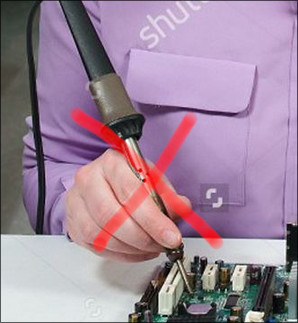
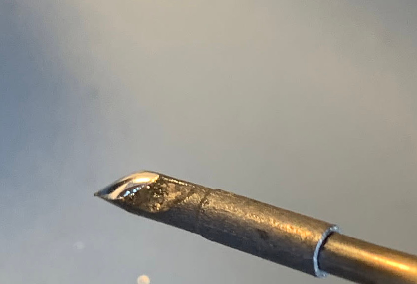
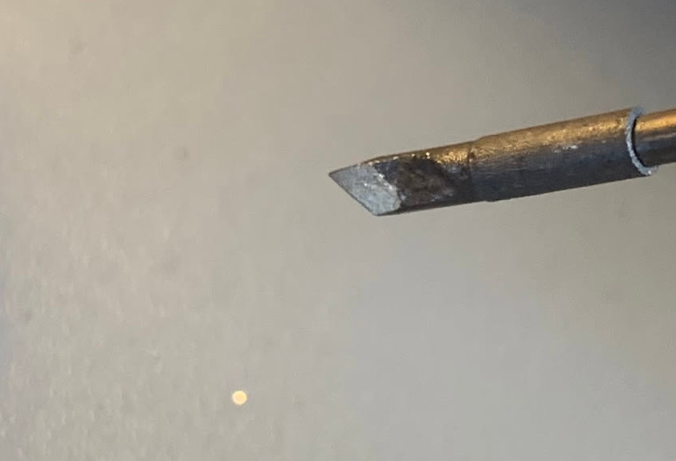
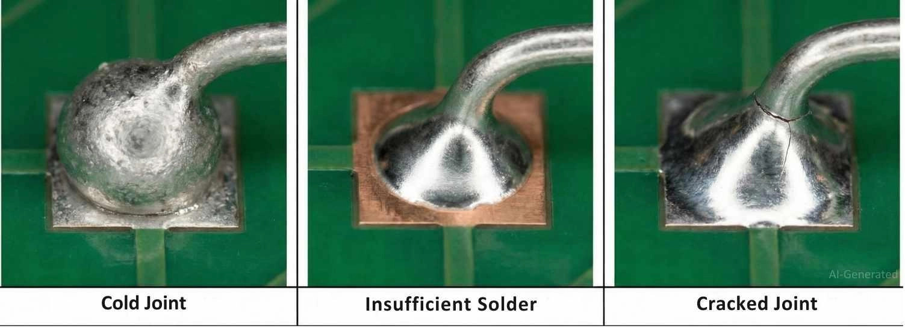
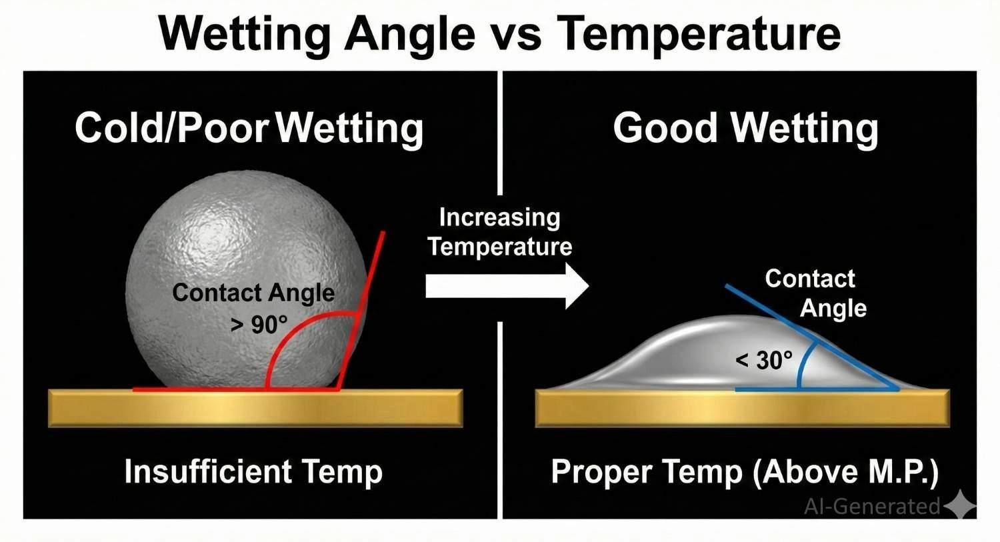
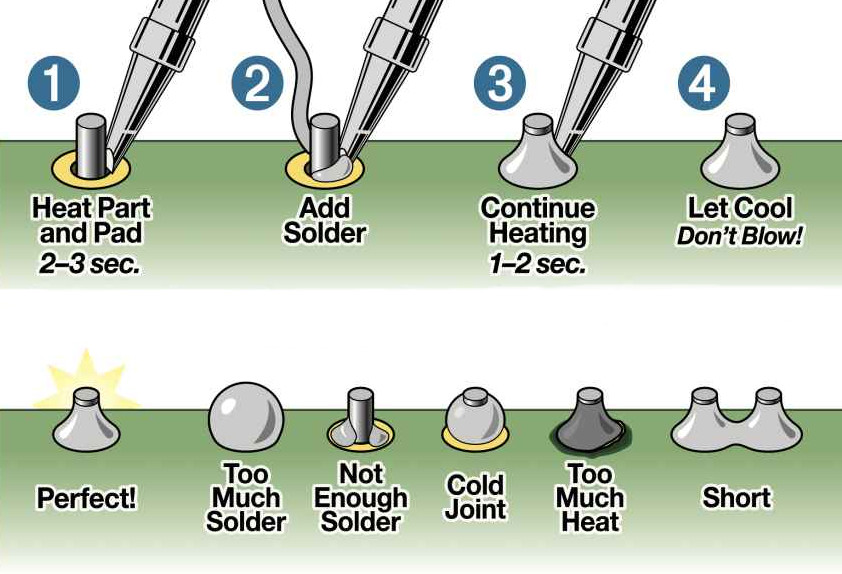

# Soudure

## Objectifs de l'atelier

- Savoir identifier et réaliser une soudure correcte
- Avoir les bons réflexes d'utilisation et de maintenance de fer à soudure
- Comprendre quand utiliser du flux

## Matériel requis

- Fer à souder
- Étain
- flux en stylo/rosin
- plaquette à trous/PCB
- Connecteurs JST
- Headers 2.54mm
- Leds/Résistances THT

## Informations

### 0. Sécurité

#### Tenue du fer

Plus sérieusement, faites particulièrement faire attention où l'on pose le fer chaud

#### Conduction de chaleur

Les composants métalliques conduisent très rapidement la chaleur (quelques secondes), attention par ou vous tenez ce que vous êtes en train de souder

### 1. Protection de la panne du fer à souder

Il est nécessaire de garder la panne du fer recouvert d'étain en permanence, que le fer soit allumé ou éteint.

Panne correctement protégé:

Panne non protégé (ne doit jamais arriver même rapidement):

-> Exemple fer oxidé

### 2. Exemples de soudures

#### Defauts

#### Guide rapide

## Atelier

### 1. Positionnement des composants

-> On commence par les moins hauts
