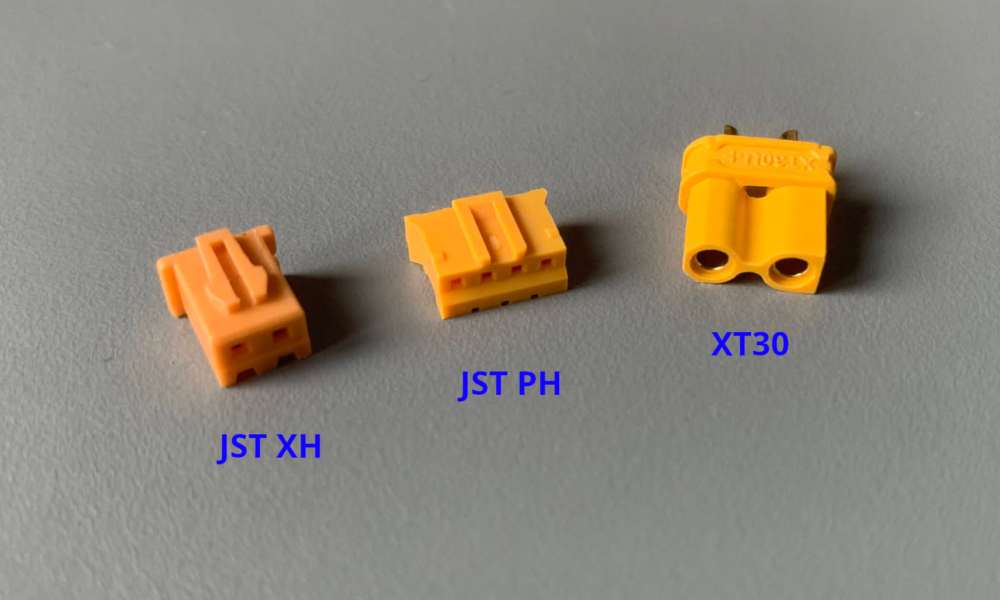
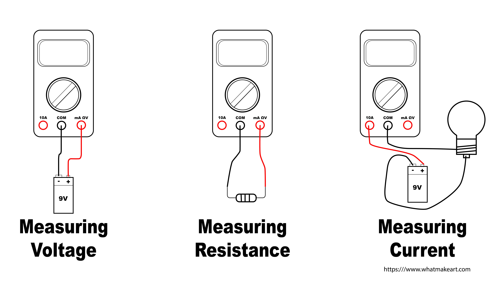
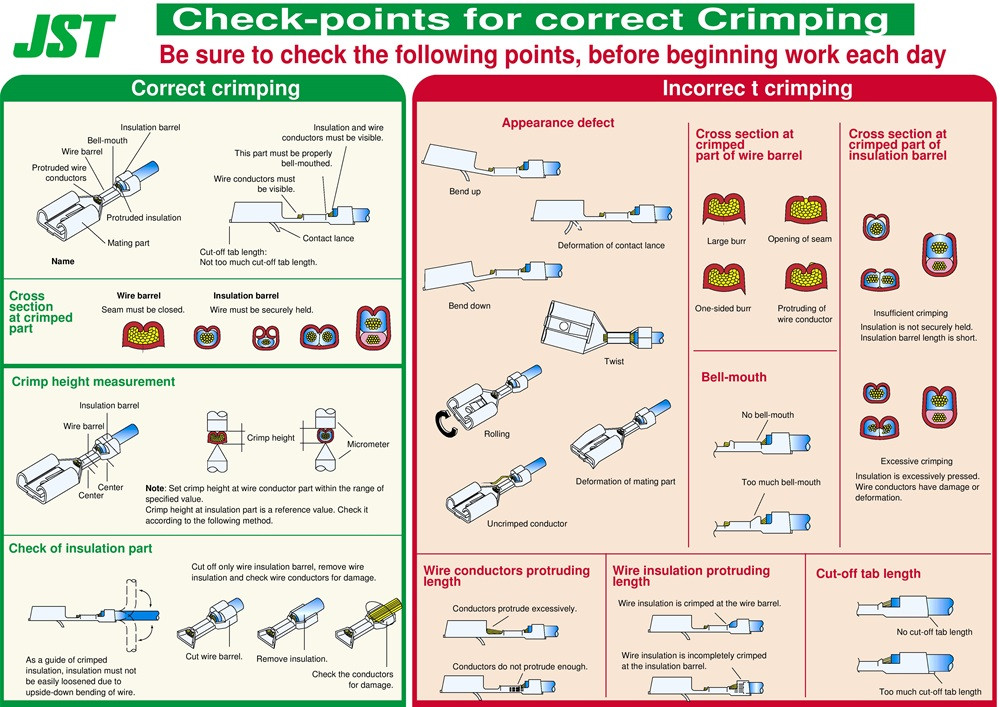
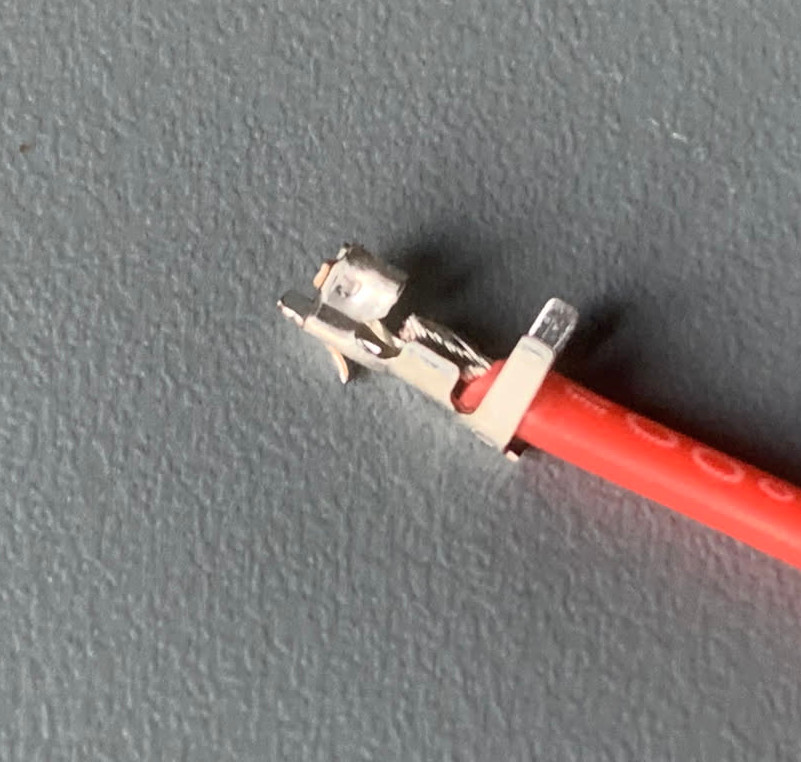
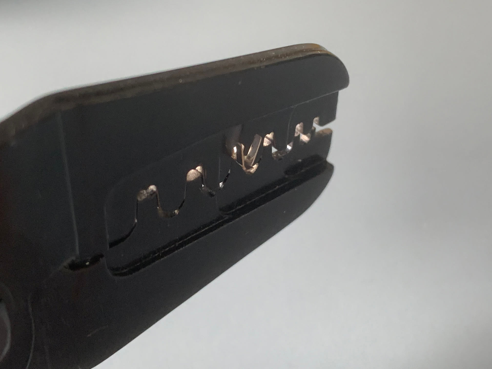
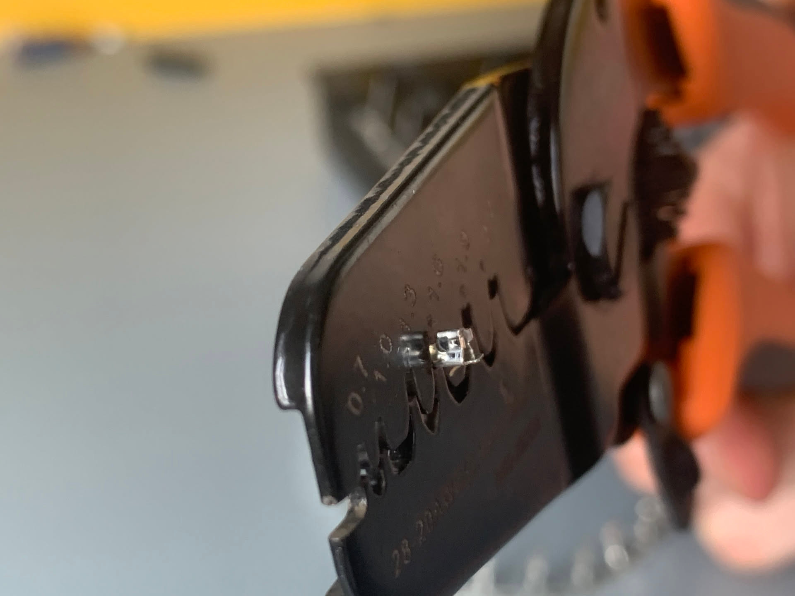
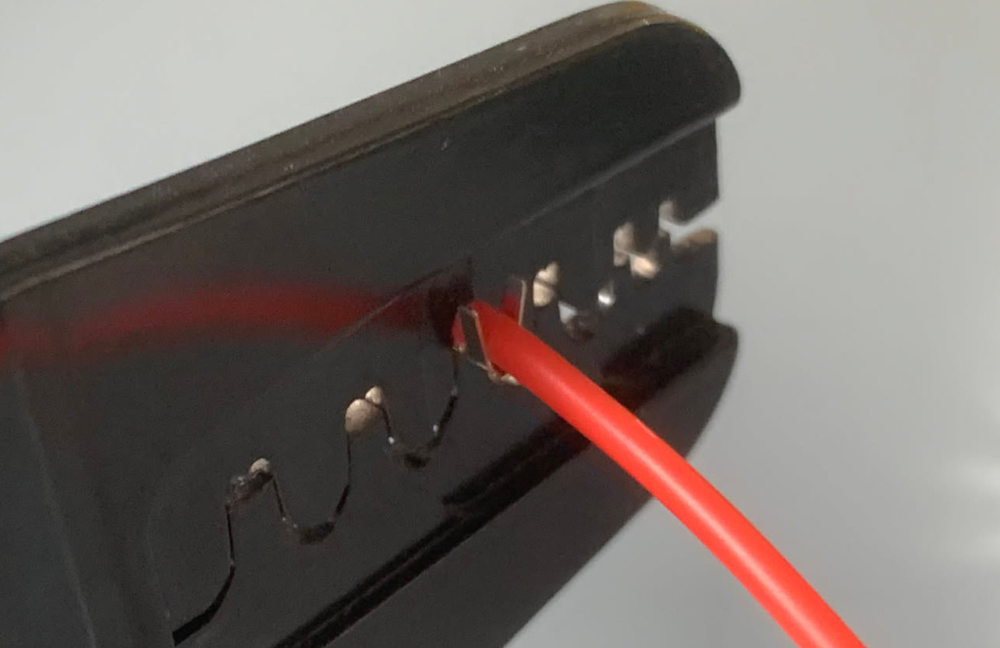
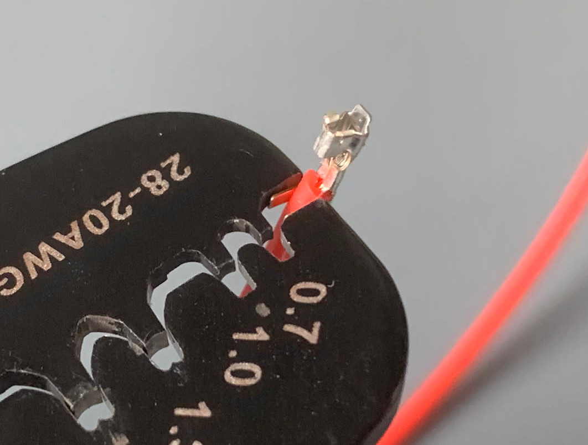
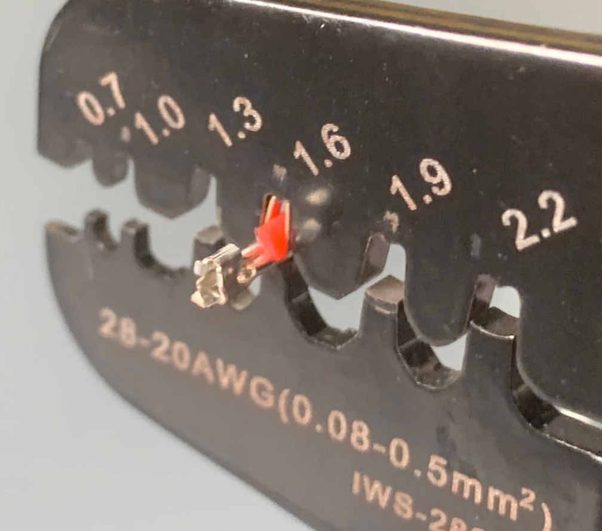
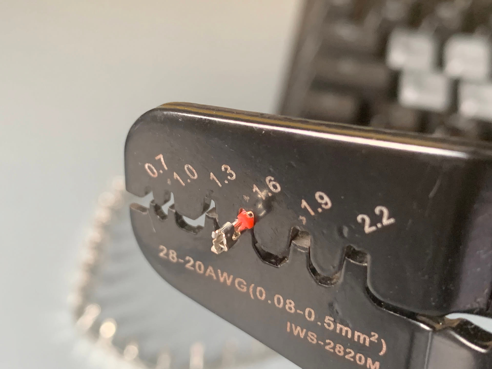

# Câbles Multimètre et Alimentation

Atelier d'introduction aux câbles et connecteurs, à l'alimentation de laboratoire et au multimètre

## Objectifs de l'atelier

- Connaître les différentes méthodes de connexions inter-PCB
- Comprendre et mesurer la perte de tension sur un câble non adapté (section / courant / longueur)
- Utiliser une alimentation de laboratoire
- Utiliser un multimètre pour mesurer une tension, un courant et une résistance
- Savoir identifier et réaliser un sertissage correct

## Matériel requis

- Multimètres (mesure de tension, courant, résistance)
- Alimentations de laboratoire (tension/courant réglables, limite de courant)
- Pinces à sertir avec mâchoires pour contacts JST XH
- Boîtiers JST XH : XHP-2 et XHP-6
- Contacts femelles JST XH à sertir
- Fils multibrins de différentes sections
- Câbles Dupont pré-faits
- Résistance de puissance / charge

## Informations

### 1. Les familles de connecteurs

Il existe plusieurs façons de connecter deux PCB (ou un PCB à une carte/charge) :

| Méthode | Usage typique | Courant typique | Démontable | Détrompeur |
|---|---|---|---|---|
| Fils soudés directement | connexions permanentes | selon section | non | non |
| Connecteur à vis 5,08 mm | borniers PCB | ~10 A | oui | non |
| Header 2,54 mm + jumper | prototypage, cartes | ~1 A | oui | non |
| JST XH / PH | cartes, batteries | ~2–3 A | oui | oui |
| XT30 / XT60 | alimentation puissance | ~30–60 A | oui | oui |

:::note
Vous avez déjà rencontré plusieurs de ces connecteurs lors de l'atelier Soudure (JST XH, connecteurs à vis 5,08 mm, headers 2,54 mm) [2]. Ce qui change ici, c'est la partie **câble et outillage** qui va avec.
:::

### 2. Différence rapide : JST XH vs JST PH vs AMASS XT30/XT60

| | JST PH | JST XH | AMASS XT30 | AMASS XT60 |
|---|---|---|---|---|
| Pas / format | 2,0 mm | 2,5 mm | bornes rondes | bornes rondes |
| Courant typique | ~2 A | ~3 A | ~30 A | ~60 A |
| Usage | signaux / faible puissance | cartes, batteries | puissance (drones, RC) | puissance (drones, RC) |
| Connexion fil | sertissage | sertissage | soudure | soudure |
| Détrompeur | oui | oui | oui | oui |

- **JST PH et JST XH** sont des connecteurs "faibles/moyens courants"" qui se **sertissent** (contact + boîtier). La différence principale est le **pas** (2,0 mm pour PH, 2,5 mm pour XH) et le courant admissible : XH est plus gros que PH. Ils ne sont **pas interchangeables** (pas de contacts ni de boîtiers en commun).
- **XT30 / XT60** (AMASS) sont des connecteurs de **puissance** pour batteries (courants bien plus élevés). XT60 est plus gros que XT30 et accepte plus de courant. Ils se **soudent** (pas de sertissage) et sont détrompés (impossible d'inverser +/−).

### 3. Parte de tension dans les câbles

Un câble a une **résistance** qui :
- **augmente avec la longueur** ;
- **diminue quand la section de cuivre augmente**.

Cette résistance crée une **chute de tension** quand un courant passe :

> U_câble = R_câble × I

Un câble trop long ou trop fin = grosse résistance = **sous-tension aux bornes de la charge** : le moteur tourne moins vite, la lampe brille moins. Rappel vu dans l'atelier Schéma : la sous-tension fait mal fonctionner sans forcément casser, alors que la surtension grille [1].

:::warning
La section du **cuivre** compte plus que la taille de l'isolant. Un câble à isolant épais mais à âme fine reste un mauvais conducteur.
:::

### 4. Alimentation de laboratoire et multimètre

**Alimentation de laboratoire**
- Régler d'abord la **tension** (sans charge), puis la **limite de courant** avant de brancher.
- En cas de court-circuit ou de courant atteint, l'alim passe en limitation de courant (CC)

**Multimètre**

| Mesure | Branchement | Mode | Attention |
|---|---|---|---|
| Tension | **en parallèle** | V DC | — |
| Résistance | en parallèle, circuit **hors tension** | Ω | jamais sur un circuit alimenté |
| Courant | **en série** dans le circuit | A DC | court-circuit si branché en parallèle ! |

:::danger
Le multimètre doit être sur la **borne courant** et branché **en série** pour mesurer un courant. Branché en parallèle sur le mode courant, il se comporte comme un court-circuit ce qui endommage le mutltimètre.
:::

### 5. Le sertissage

Le sertissage remplace la soudure pour fixer un **contact** (cosse) sur un fil. Un bon sertissage :
- enveloppe **tous les brins** de cuivre (aucun ne dépasse) ;
- se fait sur la **partie dénudée** (la gaine ne doit pas être prise dans la zone de contact) ;
- est **bien fermé** mais sans écraser/couper les brins.

**Comment le tester :**
1. **Visuel** : brins qui dépassent ? gaine coincée ? contact déformé ?
2. **Pull test** : tirer franchement sur le fil, il ne doit pas se détacher du contact.
3. **Électrique** : mesurer la continuité/résistance au multimètre.

  
Exemple sertissage JST XH

 
  Le fil doit être positionné de cette manière dans le contact:
  

  :::info
  L'insolant ne doit pas dépasser plus vert la gauche et les brins ne doivent pas dépasser dans le connecteur
  :::
  :::tip
  Il peut être compliqué de dénuder exactement la bonne longueur, préferez dénuder plus puis couper les brins
  :::

  Placer le contact dans l'outil en exerçant une légère pression pour le maintenir à l'intérieur
  
  

  Insérer le fil de la même manière que sur la première photo puis serrer la pince
  

  Utiliser le bout de l'outil pour rendre parallèle les deux branches
  
  :::warning
  Ne pas appuyer trop fort, il faut seulement mettre les deux branches parallèles
  :::

  Positionner le contact dans les mêmes dents, au niveau du serrage de l'isolant
  

  Serrer la pince
  
  :::tip
  Tenir le contact en même temps de serrer permet d'éviter de tordre le contact
  :::

## Atelier

### 1. Partie A : Sertissage d'un connecteur XHP-2 (2 fils)

#### Liste des composants
- 1 boîtier JST XH 2 positions (XHP-2)
- 2 contacts femelles JST XH (à sertir)
- 2 fils multibrins

#### Étapes
1. **Dénuder** ~2–3 mm chaque fil, sans couper de brins.
2. Positionner un **contact XH** dans la mâchoire adaptée de la pince à sertir (repère correspondant à la cosse).
3. Insérer le fil et **sertir** la partie qui pince l'âme en cuivre.
4. **Contrôle visuel** : tous les brins pris, aucun fil qui dépasse, gaine hors de la zone de contact.
5. Tirer franchement, le contact ne doit pas lâcher.
6. Insérer le contact dans le boîtier XHP-2 jusqu'au **clic** (détrompeur du boîtier), puis tirer légèrement pour vérifier le verrouillage.

### 2. Partie B : Sertissage d'un connecteur XHP-6 (6 fils)

#### Liste des composants
- 1 boîtier JST XH 6 positions (XHP-6)
- 6 contacts femelles JST XH (à sertir)
- 6 fils multibrins de **couleurs différentes** (si possible)

#### Étapes
1. Répéter le sertissage sur les **6 fils** (même longueur de dénudage, même réglage de pince).
2. Tester chaque fil avant insertion.
3. Insérer les contacts dans le boîtier XHP-6 **dans le bon ordre** (repérer les numéros de position/les clips).
4. Vérifier que chaque contact est **verrouillé** (tirer légèrement).

### 3. Partie C : Perte de tension à travers un câble XHP-2

#### Liste des composants
- 1 alimentation de laboratoire
- 1 multimètre
- Le câble XHP-2 fabriqué en **Partie A**
- 1 câble XHP-2 fourni par **Valrobotik** réalisé avec un **fil plus fin**
- 1 charge (résistance de puissance ou petit moteur CC)

#### Étapes

**Avec le câble fabriqué (Partie A) :**
1. Régler l'alimentation (tension sans charge, puis **limite de courant** raisonnable).
2. Mesurer la **résistance du câble** seul au multimètre (mode Ω) et la noter.
3. Brancher : **alim → câble XHP-2 → charge**. Mesurer le courant (en série).
4. Mesurer la tension **en sortie d'alim** puis la tension **aux bornes de la charge**. La différence = **chute de tension** dans le câble.
5. Noter les valeurs.

**Avec le câble Valrobotik (fil plus fin) :**
6. Refaire les mesures 2 à 5 avec le câble Valrobotik.
7. Comparer : fil plus fin → résistance plus grande → chute de tension plus grande → tension aux bornes de la charge plus faible.

:::note
**Interprétation** : le câble n'est pas parfait. Sa résistance (fonction de la section et de la longueur) crée une **sous-tension** aux bornes de la charge : le moteur tourne moins vite ou la lampe brille moins, sans rien casser.
:::

### 4. Partie D : Démonstrations par Valrobotik

#### Liste des composants (démonstration)
- Alimentation capable de fournir un courant élevé, avec **limite de courant**
- Fil **Dupont pré-fait très fin** (contre-exemple)
- Fil épais de référence
- Petit **moteur CC** (avec repère visuel de vitesse)
- Surface incombustible + protection oculaire

#### Démo 1 : trop de courant dans un fil trop fin (type Dupont)
Faire passer un courant nettement supérieur à la limite du fil Dupont : le fil chauffe, l'isolant fond, le fil finit par **fumer/cramer**. À faire **sous surveillance**, courant limité, sur surface incombustible.

:::danger
Un courant fort dans un cable non adapté peux causer des éteincelles voir démarrer une feu.
:::

#### Démo 2 : différence de vitesse d'un moteur selon le câble
Alimenter le même moteur avec un **gros câble**, puis avec un **câble fin** : le moteur tourne visiblement **moins vite** avec le câble fin.

### 5. Nettoyage

- Éteindre les alimentations et débrancher les câbles.
- Ranger les pinces à sertir, pinces à dénuder et multimètres.
- Trier et ranger les connecteurs et chutes de fil restants.
