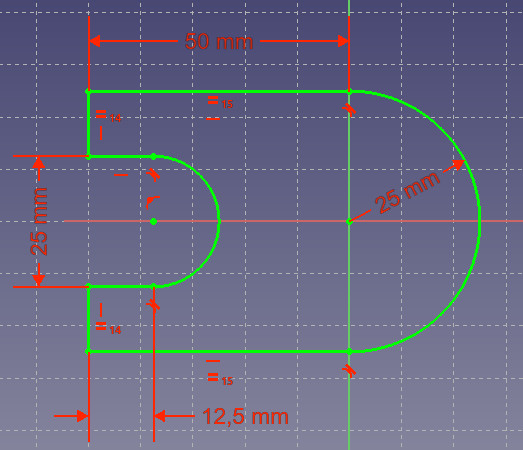
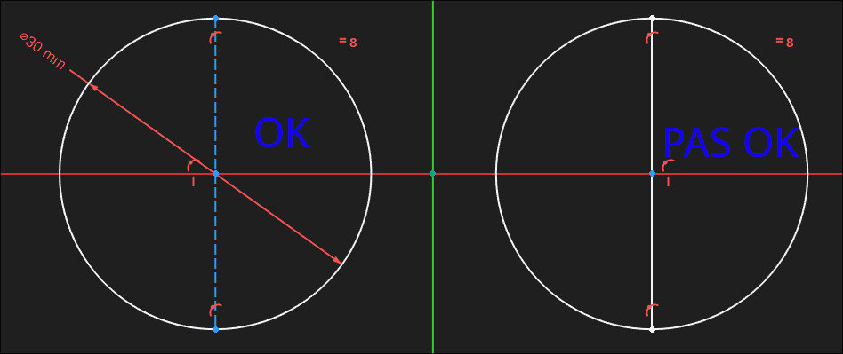
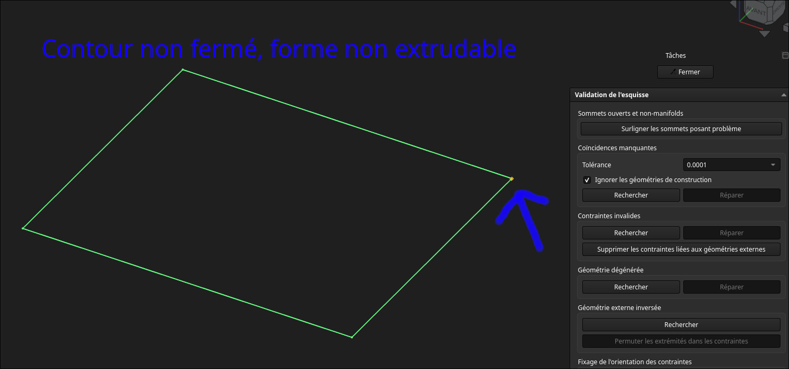
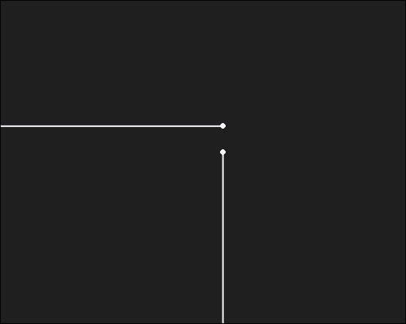
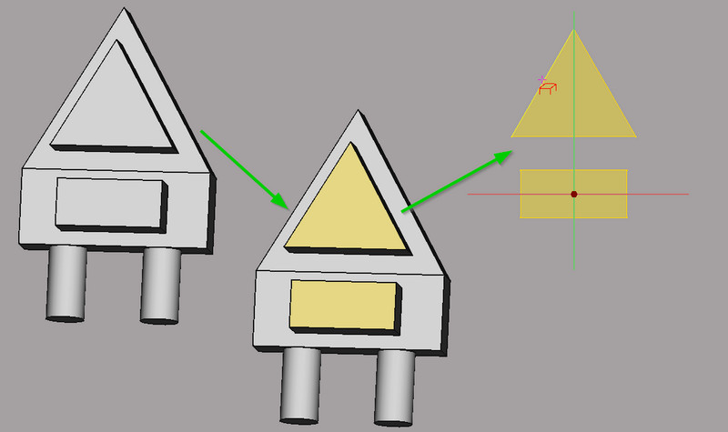

# CAO avec FreeCAD

Atelier d'introduction à la conception paramétrique avec FreeCAD

## Objectifs de l'atelier

- Modéliser une pièce simple et **paramétrique**
- Savoir utiliser les outils de mesure de FreeCAD

## Matériel requis

- PCs avec FreeCAD
- Pied à coulisse
- Pièces réelles à mesurer (pièces imprimées ou du commerce)

## Informations

### 0. Sauvegarder souvent

:::warning
Sauvegardez **avant** chaque manipulation et après chaque étape qui marche (`Ctrl+S`). FreeCAD peut planter.
:::

### 1. La conception paramétrique et l'arbre

Une pièce FreeCAD n'est pas un dessin, c'est une **recette**. On décrit une forme (une esquisse + ses cotes) et une suite d'opérations, et FreeCAD recalcule le solide à chaque modification.

- On donne des **dimensions** et des **relations**. Changer une cote met à jour toute la pièce.
- Le document contient un **Body** (le corps, une pièce), avec une **Origine** et ses trois plans (XY, XZ, YZ) et ses axes.
- L'**arbre** (panneau de gauche) liste les opérations : esquisse → protrusion → cavité → congé…
- Le solide final est le **résultat du calcul, dans l'ordre de l'arbre**. Une fonction ne peut pas exister sans ce qui la précède.

:::tip
Documentation officielle, à garder en favori :

- [Part Design](https://wiki.freecad.org/PartDesign_Workbench) — le corps, les fonctions
- [Body](https://wiki.freecad.org/PartDesign_Body) — l'objet qui contient la pièce
- [Conception par fonctions](https://wiki.freecad.org/Feature_editing) — pourquoi on construit dans l'ordre
- [Sketcher](https://wiki.freecad.org/Sketcher_Workbench) — les esquisses et les contraintes
:::

### 2. L'esquisse

L'esquisse est un dessin **2D** qui sert de base à toutes les fonctions. Elle n'est jamais libre, elle est soit posée sur un plan d'origine, soit sur une face du solide.

#### a. Les contraintes

Une esquisse n'a de sens que si elle est contrainte, chaque élément doit être **fixé**.

Certaines contraintes peuvent s'appliquer automatiquement:

- Coincidence
- Point sur objet
- Horizontale
- Verticale
- Parallèle
- Perpendiculaire
- Tangent/colinéaire
- Symétrie (point milieu de la ligne)

| Type | Exemples | Effet |
|---|---|---|
| **Géométriques** | coïncidence, horizontal, vertical, parallèle, perpendiculaire, égalité, tangence, symétrie, point sur objet | imposent une *forme* |
| **Dimensionnelles** | distance, rayon, diamètre, angle | imposent une *taille* |

On suit l'état de l'esquisse à la **couleur** des lignes : tant qu'il reste du blanc, la pièce peut encore bouger (degrés de liberté restants). Une esquisse entièrement contrainte est figée.

:::warning
Deux contraintes « qui disent la même chose » (par exemple horizontal **et** deux points à la même hauteur) se contredisent : le solveur refuse l'esquisse. Il faut alors **supprimer la contrainte en trop**, pas en ajouter une autre.
:::

:::tip
Voir la documentation de freecad pour une liste de toutes les contraintes possibles: [sketcher](https://wiki.freecad.org/Sketcher_Workbench/fr#Outils)
:::

#### b. Les lignes de construction

Ce sont des lignes de **référence** qui ne participent pas au profil : axes de symétrie, cercles primitifs de perçage, lignes de repère. On les trace avec l'outil prévu (elles apparaissent dans une couleur distincte) et elles servent uniquement de support aux contraintes.

#### c. Les projections

L'outil de **géométrie externe** projette une arête ou un sommet **déjà existant** (d'une autre esquisse, d'une autre fonction, d'un binder) dans l'esquisse en cours. C'est ce qui permet d'aligner une nouvelle fonction sur un trou existant **sans remesurer** : si la source bouge, la projection suit.

#### d. Le problème de fermeture

Pour créer un solide, la protrusion et la cavité ont besoin d'un **profil fermé**. Si l'esquisse est ouverte, la fonction échoue ou ne donne pas le volume attendu.

Les causes habituelles :

- deux extrémités qui se touchent **presque** (elles ne sont pas contraintes en coïncidence) ;
- une ligne qui dépasse au-delà de l'intersection ;
- un profil en « T » quelque part.

du à:

| Symptôme | Ce qu'on fait |
|---|---|
| Le profil semble fermé mais la protrusion échoue | zoomer sur les jonctions, vérifier les points non coïncidents |
| Contraintes en conflit | supprimer la contrainte redondante signalée par le solveur |
| On ne trouve pas le défaut | outil **Valider une esquisse** ([Sketcher ValidateSketch](https://wiki.freecad.org/Sketcher_ValidateSketch)), qui détecte les points non coïncidents |

### 3. Les fonctions de Part Design

| Outil | Nom anglais | Ce qu'il fait | Piège |
|---|---|---|---|
| **Protrusion** | Pad | extrude une esquisse fermée pour ajouter de la matière | profil non fermé → échec |
| **Cavité** | Pocket | retire de la matière selon une esquisse | gérer la profondeur "à travers tout" plutôt que deviner |
| **Symétrie** | Mirror | duplique une fonction par rapport à un plan | bien choisir le plan d'origine |
| **Congé** | Fillet | arrondit les arêtes | **à placer en fin d'arbre** |
| **Binder** | SubShapeBinder | copie une **référence** de forme depuis un autre corps | crée une dépendance |
| *Révolution* | Revolution | extrusion circulaire (utile pour les pièces tournées) | l'esquisse doit rester d'un seul côté de l'axe |
| *Répétition linéaire* | LinearPattern | répète une fonction en grille | pratique pour une plaque à trous |

:::note
Les congés et les arrondis sont problématiques, ils se calculent sur les arêtes existantes. Posés trop tôt, ils cassent dès qu'on modifie une esquisse en amont. On les met à la fin.
:::

:::tip
Voir la documentation de freecad pour une liste de toutes les fonctions possibles: [PartDesign](https://wiki.freecad.org/PartDesign_Workbench/fr)
:::

### 4. L'ordre dans l'arbre

- Le solide est calculé **fonction par fonction**, de haut en bas.
- **Renommer** les fonctions (double-clic) : au bout de dix opérations, "Pad001", "Pocket002" ne veulent plus rien dire.
- **Revenir modifier une esquisse antérieure**, c'est la puissance de la conception paramétrique.

:::warning
Piège classique : une fonction qui référence « la **face 7** » ou « l'arête 12 » peut se casser si une esquisse en amont change, parce que la face ne porte plus le même numéro. Pour éviter ça, on référence les **plans d'origine**, les **esquisses** ou un **binder**, on évite les faces de solides.
:::

### 5. Le binder pour créer la pièce complémentaire

Pour fabriquer une pièce qui s'emboîte dans une autre (un couvercle, un boîtier complémentaire, une platine), on **ne remesure pas tout à la main** :

1. Nouveau **Body** pour la nouvelle pièce.
2. **Binder** (SubShapeBinder) vers la pièce d'origine : on récupère son contour réel.
3. On esquisse **par-dessus** le contour projeté, avec un **jeu** de 0,2 à 0,4 mm (l'impression 3D n'est pas assez précise pour un contact exact).
4. On modélise la partie complémentaire (cavité, rebord, épaulement) à partir de cette référence.

L'intérêt : si la pièce d'origine est modifiée, le binder suit et la pièce complémentaire reste cohérente.

## Atelier

### 1. Partie A : Prise en main (Part Design uniquement)

#### Liste des composants

- 1 PC avec FreeCAD

#### Étapes

1. **Nouveau document**, et **sauvegarder tout de suite** en `.FCStd` (nom de fichier = votre nom).
2. Créer un **Body**. Repérer dans l'arbre : `Body`, `Origin`, les plans XY / XZ / YZ et les axes.
3. Repérer les zones de l'écran : arbre à gauche, vue 3D, panneau des tâches, barre d'outils **Part Design**.
4. Fermer et rouvrir le fichier : on doit retomber exactement sur le même arbre.
5. Changer la vue (dessus, face, axonométrique) et apprendre à tourner la pièce à la souris.

:::note
On reste dans **Part Design**. Les assemblages, les ateliers externes et l'export seront vus dans l'atelier Assemblage.
:::

### 2. Partie B : Cercle et protrusion

#### Liste des composants

- 1 PC avec FreeCAD

#### Étapes

1. **Nouvelle esquisse** sur le plan XY.
2. Tracer un **cercle** et le contraindre en coïncidence avec l'**origine**.
3. Coter le **diamètre** (contrainte dimensionnelle). Vérifier que l'esquisse est **entièrement contrainte**.
4. **Fermer l'esquisse** puis faire une **protrusion** de 10 mm.
5. Tourner autour de la pièce, changer la vue. Sauvegarder.

### 3. Partie C : Modifier la pièce avec toutes les fonctions

#### Liste des composants

- 1 PC avec FreeCAD
- La pièce de la Partie B

#### Étapes

1. **Revenir dans la première esquisse** et changer le diamètre : la protrusion suit. Sauvegarder.
2. **Cavité** : nouvelle esquisse sur la face supérieure, un cercle décalé, cavité « à travers tout ».
3. **Lignes de construction** : remplacer la cote de position par un cercle primitif de construction, puis placer le trou dessus.
4. **Symétrie** : dupliquer la cavité par rapport au plan YZ, comparer avec une deuxième cavité dessinée à la main.
5. **Projections** : projeter l'arête d'un trou dans une nouvelle esquisse pour aligner une autre fonction dessus.
6. **Congé** : arrondir les arêtes supérieures. Observer le temps de recalcul.
7. **Ordre dans l'arbre** : faire passer le congé **avant** la cavité, recalculer, constater si l'arbre tient encore. Le remettre à la fin.
8. **Renommer** les fonctions, sauvegarder.

:::warning
Après chaque étape, vérifier que l'arbre est **recalculé sans erreur**. Une fonction en erreur doit être corrigée tout de suite, plus tard, on ne sait plus d'où elle vient.
:::

### 4. Partie D : Binder et pièce complémentaire

#### Liste des composants

- 1 PC avec FreeCAD
- La pièce de la Partie C
- 1 pied à coulisse

#### Étapes

1. Créer un **nouveau Body** à côté du premier.
2. Créer un **Binder** vers la pièce d'origine, et vérifier la forme récupérée.
3. Esquisser un contour **autour** de ce binder, avec un **jeu de 0,2 à 0,4 mm**.
4. Modéliser la partie complémentaire (cavité ou rebord) et vérifier qu'elle **recouvre** bien la pièce.
5. Modifier la pièce d'origine (un rayon, une côte) et observer le comportement de la pièce complémentaire.

### 5. Partie E : Mesurer une pièce réelle et comparer

#### Liste des composants

- 1 pied à coulisse
- 1 pièce réelle (imprimée ou du commerce)
- 1 PC avec FreeCAD

#### Étapes

1. Mesurer au pied à coulisse **trois côtes significatives** de la pièce (longueur, largeur, diamètre d'un trou).
2. Modéliser la pièce dans FreeCAD avec **ces** côtes, en utilisant l'outil de **mesure** de FreeCAD pour vérifier le modèle.
3. Comparer les cotes du modèle avec les mesures relevées.
4. Imprimer la pièce (ou la comparer à une impression existante) et la **remesurer**.
5. Corriger l'écart directement **dans l'esquisse** et observer la mise à jour.

:::tip
Outils de mesure : [Std Measure](https://wiki.freecad.org/Std_Measure) et les outils de mesure de l'atelier **Part** (distance, angle, rayon).
:::

### 6. Exercices supplémentaires

Pour s'entraîner hors atelier, il existe des pièces d'entraînement progressives (formes simples au début, puis pièces avec plans inclinés, nervures et perçages) sur [tootalltoby.com](https://www.tootalltoby.com/). En choisir deux :

- une pièce **simple**, à traiter comme la Partie C ;
- une pièce **plus complexe**, qui oblige à réfléchir à l'ordre des fonctions.

#### Exercice libre : plaque sur grille de 20 mm

Modéliser une **plaque à trous sur une grille de 20 mm** (perçages réguliers, bords arrondis, un congé sur les angles) :

1. Esquisser un seul trou, contraint à la grille ;
2. le répéter avec une **répétition linéaire** ou une **symétrie** ;
3. ajouter les congés en fin d'arbre ;
4. vérifier qu'un changement de pas de grille met à jour toute la plaque.

### 7. Nettoyage

- Sauvegarder les `.FCStd` (nom de fichier = votre nom) et les ranger dans le dossier du cours.
- Ranger les pieds à coulisse et les pièces de démonstration.
- Éteindre les PCs.
