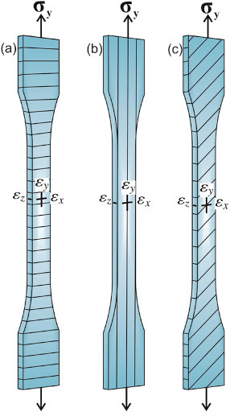
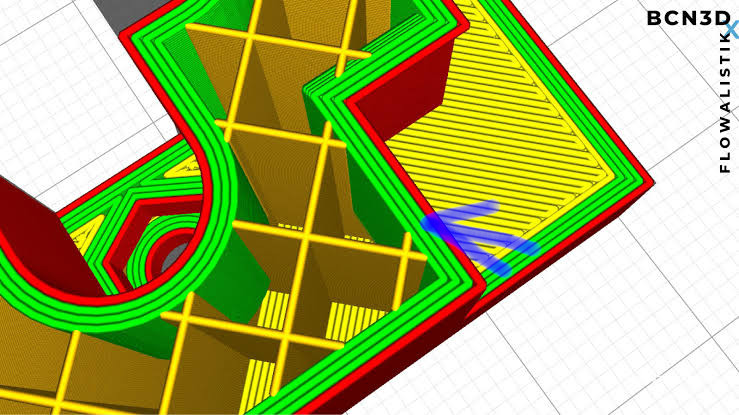
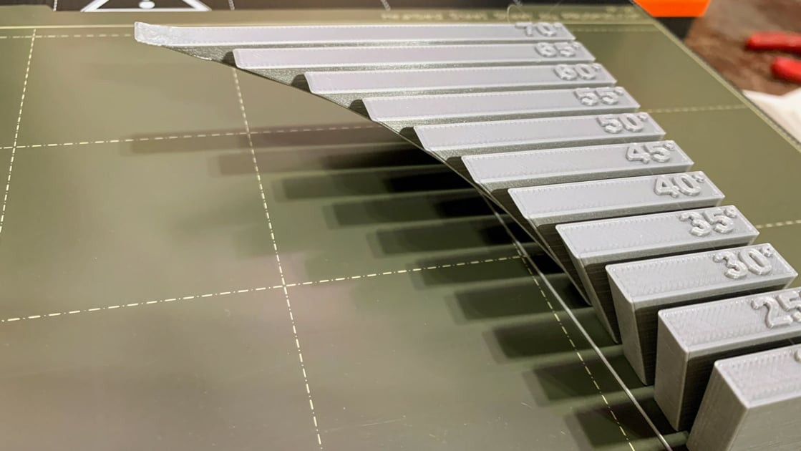
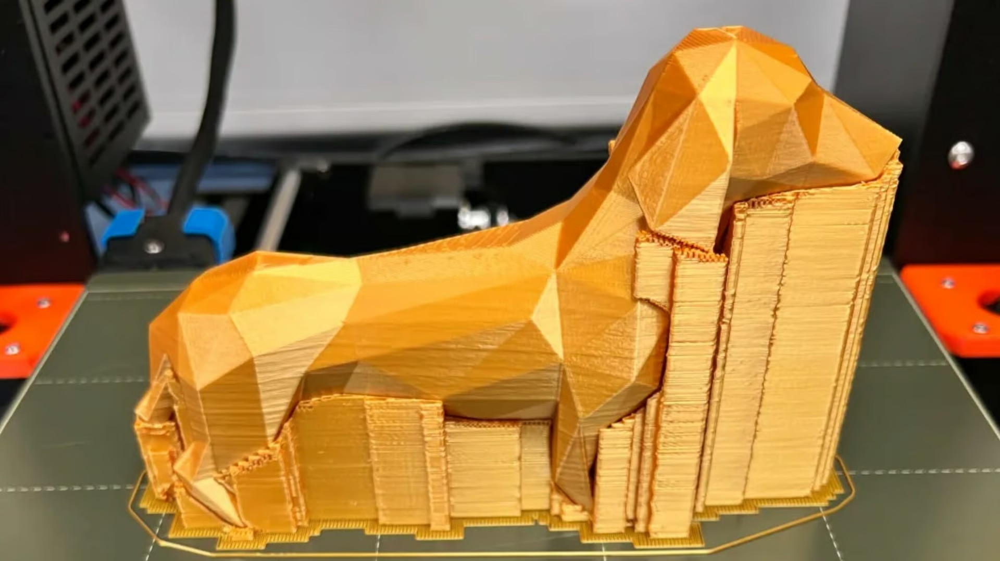
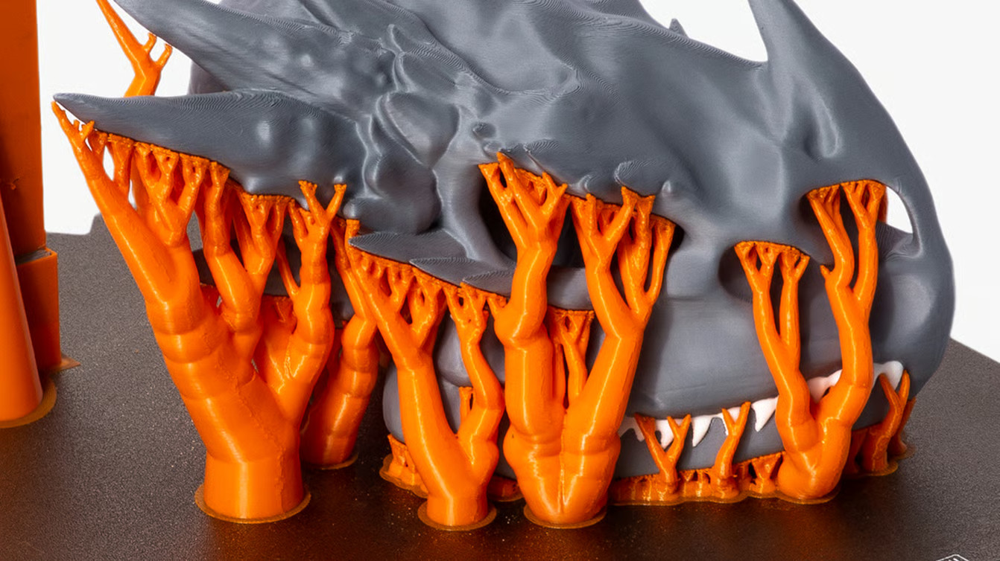

# Impression 3D

Atelier d'introduction à l'impression 3D FDM : de la CAO à la pièce, avec un slicer

## Objectifs de l'atelier

- Comprendre les contraintes de fabrication propres à l'impression 3D
- Comprendre la différence entre les fichiers **.FCStd, .STEP, .3MF/.STL** et **.GCODE**
- Savoir choisir les bons paramètres d'impression
- Utiliser un slicer (Orca Slicer, Bambu Studio ou PrusaSlicer)
- Identifier les défauts courants et savoir les régler
- Savoir choisir le bon filament (PLA / PETG)
- Savoir préparer une imprimante

## Matériel requis

- Imprimantes 3D FDM (Bambu Lab / Prusa)
- PCs avec un slicer installé (Orca Slicer)
- Pièces de démonstration : pièces cassées (décollement de couches), surplombs, ponts, tests de tolérances
- Filaments PLA et PETG
- Alcool isopropylique (IPA) + chiffon non pelucheux pour le lit
- Laine pour nétoyer la buse

## Informations

### 0. Sécurité

#### Chaleur

:::danger
La buse (200–250 °C) et le plateau (60–85 °C) brûlent rapidement. Ne jamais approcher les doigts d'une tête en mouvement (Surtout sur la X1C)
:::

#### Mécanique et manipulations

:::warning
La tête et le plateau bougent vite et fort. On met en pause avant de toucher quoi que ce soit à l'intérieur, et on attend que le plateau refroidisse si la pièce est trop difficile à décoller.
:::

### 1. La chaîne de fabrication : du CAO à la pièce

Trois familles de fichiers, trois étapes différentes :

```text
  FreeCAD (.FCStd)
        │  export
        ▼
      .STEP  ────►  SLICER  ────►  .GCODE  ────►  Imprimante
   (Modèle 3D)     (conversion en couches)   (instructions machine)
```

| Format | Ce que c'est | Modifiable ? | Contient |
|---|---|---|---|
| **.FCStd** | projet **FreeCAD** (CAO paramétrique) | oui, complètement (esquisse, arbre de construction) | historique de construction, contraintes, paramètres |
| **.STEP** | standard d'échange de **solide** (B-Rep) | oui, la plupart des CAO le rouvrent comme un solide | géométrie exacte, **pas** d'historique |
| **.STL** | **maillage** de triangles (« peau » figée) | compliqué | triangles seulement : pas d'unité, pas d'échelle, pas de couleur |
| **.3MF** | maillage **+** métadonnées | compliqué | maillage + unités + orientation, souvent les réglages du slicer |
| **.GCODE** | **instructions machine** | très compliqué | déplacements, températures, vitesses, rétractions -> spécifique à une imprimante |

- On **modifie** un `.FCStd`, on **échange** un `.FCStd`/`.step` pour l'impression, on **imprime** un `.GCODE`.
- Le **GCODE est propre à l'imprimante et au filament** (et parfois au plateau / à la buse). Un GCODE généré pour une Prusa ne s'imprime pas sur une Bambu.
- Pour un aller-retour en CAO, on demande toujours le **FCStd** (ou le STEP) **jamais** le STL/3mf.

:::note
Il est possible de retrouver un modèle paramétrique à partir d'un fichier maillé (stl/3mf) en faisant ce qu'il s'appelle du reverse-engineering, ce n'est pas l'object de l'atelier.
:::

### 2. Murs et anisotropie : la solidité d'une pièce imprimée

Une pièce imprimée n'est **pas** un bloc homogène, c'est un empilement de cordons de plastique fondu collés les uns aux autres:

**a. L'anisotropie**



| Direction de l'effort | Comportement | Pourquoi |
|---|---|---|
| **Dans le plan des couches (XY)** | **résistant** | c'est le plastique lui-même qui travaille, cordon par cordon |
| **Perpendiculaire aux couches (Z)** | **la pièce se décolite** | seule la liaison entre deux couches tient la charge |

:::danger
La liaison entre deux couches est **bien plus faible** que la résistance du plastique lui-même. Une pièce sollicitée « entre les couches » ne casse pas net : elle se **délite**, couche par couche.
:::

**b. Ce sont les murs qui portent la charge**

La solidité vient des **murs (périmètres)**, pas du remplissage.



| Paramètre | Rôle réel | Effet sur la solidité |
|---|---|---|
| **Murs / périmètres** | coque de la pièce, reprend la traction et la flexion | **fort +++** |
| **Remplissage (infill)** | supporte les couches du dessus, évite l'affaissement | modéré |
| **Couches sup./inf.** | ferment la pièce, évitent les trous | faible (propreté, étanchéité) |

:::tip
En pratique : monter de **2 à 4 murs** apporte beaucoup plus de solidité que de passer le remplissage de 15 % à 50 %, et pour beaucoup moins de temps et de filament.
:::

### 3. Contraintes de fabrication

#### a. L'orientation

Il faut choisir en même temps **où la pièce est solide**, **quelle face touche le plateau** et **combien de supports** il faudra. Les trois se contredisent souvent : il faut arbitrer.

| Orientation | Avantages | Inconvénients |
|---|---|---|
| À plat | solide dans le plan, rapide, peu de supports | peut casser en flexion entre les couches |
| Debout | bon pour les pièces en compression | moins solide en traction, plus de supports, plus long |

#### b. Surface sur la plaque

- La face posée sur le plateau prend **l'état de surface du plateau** (lisse, texturé PEI, « peau d'orange »). C'est en général la plus propre : on y met la face **visible** ou la face **fonctionnelle plane**.
- Attention au **pied d'éléphant** : la première couche est écrasée pour adhérer, elle peut légèrement baver sur les côtés. Une surface d'appui précise imprimée directement sur le lit sera fausse de quelques dixièmes.
- Une **grande surface plane** sur le lit = risque de **warping**.

#### c. Les surplombs (overhangs)

Un surplomb s'imprime tant que la couche suivante repose suffisamment sur la précédente.



| Angle par rapport à la verticale | Résultat |
|---|---|
| **< 45°** | passe tout seul |
| **≈ 45°** | limite (dépend du refroidissement, de la hauteur de couche) |
| **> 45°** | affaisse, bave → **supports** nécessaires |
| **Pont (bridge)** | franchissement horizontal entre deux appuis : faisable avec un bon refroidissement, **sans** support |

#### d. Les tolérances

L'imprimante n'est pas très précise:

- un **trou** imprimé sort toujours **plus petit** que dessiné (le cordon se referme) ;
- un **axe** sort toujours **plus gros** ;
- le jeu FDM typique est de **0,2 à 0,4 mm** (par côté) selon l'imprimante et la buse.

:::warning
Ne pas concevoir de filetage M3 imprimé juste, prévoir un avant-trou pour insert thermique ou un logement d'écrou. De même, ne pas empiler les tolérances sur une chaîne de pièces.
:::

#### e. Les supports et leurs limites

Les supports **marquent la surface**, sont **difficiles à enlever** dans les cavités et peuvent casser les petites features. Avant de mettre du support partout :

1. **Réorienter** la pièce ;
2. ajouter des **chanfreins** (un chanfrein à 45° remplace un support) ;
3. **diviser** la pièce en deux et l'assembler ;
4. seulement ensuite : supports.

##### Supports Linéaires



##### Supports Organiques



| Type de support | Usage |
|---|---|
| Grille / linéaire | cas général, facile à enlever sur surface plate |
| **Organique** | surplombs ponctuels, cavités difficiles, moins de matière |
| Dissoluble (PVA) | géométries impossibles à nettoyer, surfaces internes propres |

**Supports avec modificateurs :** dans un slicer moderne, on ne met pas de support « partout ». On **peint** les zones où l'on en veut, et on **bloque** ailleurs. De la même manière, un **modificateur** est un volume qui impose des réglages locaux (plus de murs ou plus de densité autour d'un trou de vis, moins de remplissage dans une zone creuse).

### 4. Défauts d'impression courants

| Défaut | Cause | Correctif |
|---|---|---|
| **Première couche qui n'accroche pas** (cordons séparés, accroche par morceaux) | lit sale (traces de doigts/graisse), Z-offset trop haut, plateau voilé ou mauvais revêtement, températures basses | laver le lit à l'alcool, refaire leveling / Z-offset, monter un peu la température du lit et de la première couche, première couche **lente**, **augmenter la surface** de contact (brim) |
| **Warping** (coins qui se relèvent, pièce décollée) | retrait du plastique en refroidissant (grande surface plane, matériau qui retire, courants d'air) | **brim**, lit propre et chaud, caisson / éviter les courants d'air, **sectionner la surface au sol** (évider, ajouter des dégagements, arrondir) |
| **Spaghetti** (pelote de fil) | la première couche a lâché, la buse a imprimé dans le vide et a tiré le fil | arrêter immédiatement, nettoyer, **refaire**, la prévention, c'est la surveillance de la première couche |
| **Cheveux d'ange (stringing)** | température trop haute, rétraction insuffisante, filament humide | baisser la température, régler la rétraction, **sécher** le filament |
| **Sous-extrusion / buse qui claque** | buse partiellement bouchée, débit mal réglé, filament abîmé ou humide | purge, déboucher (aiguille / cold pull), sécher le filament |
| **Décalage de couches (layer shift)** | courroies ou poulies desserrées, vitesse trop élevée, pièce qui a bougé | retendre, baisser la vitesse, vérifier l'adhérence |
| **Pied d'éléphant** | première couche trop écrasée | régler Z-offset, activer la compensation prévue par le slicer |

:::note
La grande majorité des défauts se **lisent sur la première couche**.
:::

:::tip
Pour plus d'informations, voir le guide de [simplify3D](https://www.simplify3d.com/resources/print-quality-troubleshooting/)
:::

### 5. Préparer l'imprimante

- **Nettoyage de la surface du lit** : alcool + chiffon propre. **Ne pas toucher la surface avec les doigts**, le gras de la peau est le premier ennemi de l'adhérence.
- **Nettoyage / vérification de la buse** : purge avant impression, retirer les résidus, vérifier qu'aucun filament ne colle autour ; si la buse est partiellement bouchée, ne pas lancer l'impression
- **Vérification mécanique** : plateau sans jeu, leveling automatique, Z-offset, bobine qui tourne librement.
- **Surveillance de la première couche** : on reste devant la machine pendant la première couche. Critères : cordons **jointifs** et **légèrement écrasés**, pas d'espace entre les lignes, surface régulière, aucune levée.
- **Changement de filament** : voir Partie A. Toujours purger complètement entre deux couleurs ou deux matériaux.

:::tip
En cas de doute, n'hésitez pas à demander de l'aide à un membre plus expérimenté
:::

### 6. Choisir son filament : PLA vs PETG

| | **PLA** | **PETG** |
|---|---|---|
| Température buse | 190–220 °C | 230–250 °C |
| Température plateau | 55–65 °C | 70–85 °C |
| Rigidité | très rigide | plus souple / ductile |
| Résistance aux chocs | faible (cassant) | bonne |
| Température d'usage | ~55–60 °C (se ramollit) | ~70–80 °C |
| Adhérence au plateau | facile | colle beaucoup (PEI texturé conseillé) |
| Facilité | le plus indulgent | tolère moins d'erreurs (stringing, adhérence) |
| Usage typique | prototypes, boîtiers, maquettes, décoratif | pièces fonctionnelles, supports, pièces un peu chaudes |

Exemples concrets :

- **PLA** : un boîtier de prototype, un support de LED, une maquette d'assemblage. À éviter pour une pièce qui vit dans une voiture au soleil (elle se déforme) ou qui doit encaisser des chocs répétés.
- **PETG** : un support de moteur, un clip qui doit fléchir sans casser, une pièce proche d'un élément tiède. Plus résistant, mais plus délicat : filaments qui collent au plateau, cheveux d'ange, adhérence capricieuse.
- **TPU** (souple), **ABS/ASA** (résistants à la chaleur et aux UV, mais nécessitent un caisson) : à mentionner, à réserver aux besoins réels.
- **Les deux craignent l'humidité** : un filament humide crépite dans la buse, donne un aspect irrégulier et beaucoup de stringing → on le **sèche** (déshydrateur / four) et on le range avec un dessiccant.

### 7. Un slicer : le vocabulaire minimal

Orca Slicer, Bambu Studio et PrusaSlicer partagent le **même moteur de slicing** (dérivés de PrusaSlicer) : les concepts ci-dessous sont identiques, seule l'interface change. Un profil = imprimante + filament + qualité.

| Paramètre | Ce que ça change | Point de vigilance |
|---|---|---|
| Hauteur de couche | finesse vs temps | 0,2 mm = standard ; 0,28 mm rapide ; 0,12 mm fin |
| Murs / périmètres | **solidité** | 3–4 murs |
| Remplissage | support interne | 10–20 % suffisent souvent (gyroïde / cubique) |
| Couches sup./inf. | fermeture de la pièce | ≥ 3 |
| Supports | zones en surplomb | à **limiter**, à peindre |
| Brim / skirt / raft | adhérence | brim pour les grandes pièces plates |
| Vitesses | temps vs qualité | **première couche lente** |
| Températures | fusion et adhérence | suivre la fiche du filament |
| Refroidissement | surplombs vs warping | moins de ventilation sur la première couche |

## Atelier

### 1. Partie A : Chargement / déchargement du filament (Bambu / Prusa)

#### Liste des composants

- 1 imprimante 3D (Bambu Lab ou Prusa)
- 1 bobine de PLA
- 1 bobine de PETG
- 1 pince coupante

#### Étapes

1. **Chauffer la buse** via l'écran (menu charge/décharge du filament sur Bambu, *Preheat PLA* sur Prusa).
2. **Couper l'extrémité** du filament en biseau
3. **Insérer** et pousser jusqu'à ce que la machine entraîne le filament ; laisser extruder un cordon.
4. **Contrôler le cordon** : régulier, vers le bas, pas en spirale (spirale = buse partiellement bouchée).
5. **Décharger** : chauffer, laisser la machine dégager le filament, retirer, recouper l'extrémité et la fixer sur la bobine.
6. Refaire la manip avec le **PETG** et comparer (températures, souplesse, adhérence du cordon).

:::warning
Ne jamais tirer sur le filament à froid : on abîme l'extrudeur. On chauffe d'abord, on décharge ensuite.
:::

### 2. Partie B : Premier slicing et première impression (pièce simple et rapide)

#### Liste des composants

- 1 PC avec le slicer
- 1 imprimante 3D préparée
- 1 bobine de PLA
- 1 pied à coulisse
- [Modèle 3D pour l'impression](./files/impression/piece-1.step)

#### Étapes

1. **Importer** le fichier fourni (.STEP). Vérifier les **unités** et l'échelle (une pièce de 20 mm doit mesurer 20 mm).
2. **Orienter** la pièce : face plane sur le plateau, aucun surplomb important.
3. Ajouter du texte sur la pièce.
4. Élargir la pièce pour le texte
5. Choisir le **profil** : imprimante + filament PLA + qualité 0,2 mm.
6. **Lire l'aperçu** : hauteur de la pièce, temps d'impression, consommation de filament, et surtout **la première couche**.
7. Envoyer directement l'impression par le réseau.
8. Lancer et **rester devant la première couche**. Si ça n'accroche pas : arrêter, nettoyer le lit, refaire.
9. Une fois la pièce sortie, la **mesurer au pied à coulisse** et noter l'écart avec les cotes de conception

### 3. Partie C : Murs, supports et modificateurs

#### Liste des composants

- 1 PC avec le slicer
- 1 pièce de démonstration avec **surplomb et pont**
- 1 imprimante 3D + PLA

#### Étapes

1. Slicer la pièce **sans support** et observer l'aperçu : repérer les zones en surplomb.
2. **Réorienter** la pièce pour minimiser les surplombs, puis comparer les temps et la quantité de filament.
3. Ajouter du **support peint** uniquement sous la zone nécessaire, en **arbre** ; comparer avec un supports partout
4. Ajouter un **brim** sur un test de grande surface plate et observer la différence au niveau de la première couche.
5. Passer les **murs de 2 à 4** et mesurer l'effet sur le temps et sur la rigidité de la pièce imprimée (test de flexion à la main).
6. Ajouter un **modificateur** (volume) pour densifier localement une zone qui reprend une vis, ou au contraire alléger une zone pleine.

:::note
L'objectif n'est pas de trouver « les bons réglages », mais de comprendre **le coût** de chaque choix.
:::

### 4. Partie D : Préparer une pièce complexe

#### Liste des composants

- 1 PC avec le slicer
- 1 fichier de pièce complexe fourni (.STEP ou .FCStd)
- 1 imprimante 3D + filament adapté (PLA ou PETG selon l'usage)

#### Étapes

1. **Ouvrir** la pièce et identifier sa fonction, quels efforts elle subit, quelle face est visible, quelles cotes sont critiques.
2. Choisir l'**orientation** en justifiant, sens des efforts (anisotropie), surface posée sur le plateau, surplombs.
3. Décider des **supports** : où, quel type (grille / arbre), et où les **bloquer** quand c'est inutile.
4. Adapter les réglages (**murs, remplissage, hauteur de couche**) à la fonction de la pièce.
5. Vérifier les **tolérances** prévisibles (trous, axes, emboîtements) et le temps total.
6. Valider l'aperçu

### 5. Nettoyage

- Laisser **refroidir le plateau** puis retirer la pièce (souvent elle se décolle seule) — sinon à la **spatule**, jamais au cutter.
- **Nettoyer la surface du lit à l'alcool si besoin** et remettre le plateau en place.
- Éteindre les imprimantes et les PCs, ranger les pièces de démo, les chutes et les pinces.
